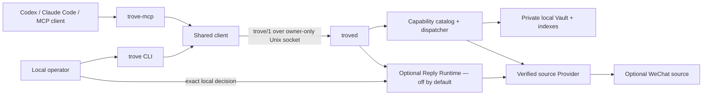

<p align="center">
  <strong>English</strong> · <a href="README.zh-CN.md">简体中文</a>
</p>

<h1 align="center">TROVE</h1>

<p align="center">
  <strong>Local-first, privacy-preserving memory and cited evidence for AI agents.</strong>
</p>

<p align="center">
  A macOS runtime that gives Codex, Claude Code, and other MCP clients bounded access to a local evidence Vault—without turning personal data into a cloud service.
</p>

<p align="center">
  <a href="https://github.com/JNHFlow21/trove/actions/workflows/ci.yml"></a>
  <a href="https://github.com/JNHFlow21/trove/actions/workflows/privacy-scan.yml"></a>
  <a href="https://www.apple.com/macos/"></a>
  <a href="https://www.python.org/"></a>
  <a href="LICENSE"></a>
</p>

<p align="center">
  <a href="https://github.com/JNHFlow21/trove/stargazers"></a>
  <a href="https://github.com/JNHFlow21/trove/forks"></a>
  <a href="https://github.com/JNHFlow21/trove/commits/main"></a>
  
</p>

TROVE is not a general-purpose autonomous agent and it is not a hosted chat
database. It is a local capability runtime: external agents ask for recall,
search, context, or a controlled operation; TROVE returns a typed, size-bounded
result with citations and coverage metadata.

The product is **TROVE**. WeChat is one optional source Provider, not the
product identity.

## Why TROVE

| Common approach | TROVE |
| --- | --- |
| Copy whole conversations into an agent prompt | Return only bounded evidence needed for the current task |
| Let every client open the database directly | One owner-only daemon coordinates each canonical Vault |
| Treat retrieved text as instructions | Treat messages, filenames, OCR, and transcripts as untrusted evidence |
| Give an agent ambient write or send authority | Separate requests from human approval and delivery policy |
| Hide partial retrieval behind a confident answer | Return citations, coverage, cursors, and typed errors |

## Architecture



There is no public network listener. One canonical Vault maps to one daemon.
The CLI and MCP adapter use the same protocol, catalog, validation, and
dispatcher, so the recovery path and agent path cannot silently diverge.

## Core capabilities

- **Bounded recall and search** — result limits, response budgets, opaque
  cursors, coverage metadata, and stable citations.
- **Local-first storage** — Vault data, indexes, caches, and operation journals
  stay under an owner-controlled path outside this repository.
- **Agent-native MCP** — cumulative `standard`, `operations`, and `admin` packs;
  use the smallest pack that completes the task.
- **Typed failure semantics** — retry only when `error.retryable` is true;
  ambiguity and incomplete coverage are explicit.
- **Provider boundary** — source integrations implement a verified contract;
  WeChat support is independently packaged.
- **Human-controlled actions** — approval decisions require an interactive
  controlling terminal. MCP and background jobs cannot approve themselves.
- **Privacy gates** — synthetic fixture rules, current-tree scanning, full Git
  history scanning with Gitleaks, and CI checks on every push and pull request.

## Quick start from source

### Requirements

- macOS
- Python 3.11 or newer
- Git

Clone the public source and install the lightweight base runtime:

```bash
git clone https://github.com/JNHFlow21/trove.git
cd trove
TROVE_RUNTIME_INSTALL_EXTRAS="" bash scripts/bootstrap_runtime.sh
```

Create an owner-only Vault **outside** the source checkout and run the redacted
health check:

```bash
export TROVE_VAULT_ROOT="$HOME/Trove/trove-vault"
mkdir -p "$TROVE_VAULT_ROOT"
chmod 700 "$TROVE_VAULT_ROOT"
.venv/bin/trove --vault "$TROVE_VAULT_ROOT" doctor
```

The default macOS bootstrap additionally supports
`local-vision,local-embedding,zvec`. See [testing](docs/testing.md) before
installing optional local ASR, VLM, key-capture, or cloud-retrieval extras.

### Connect an MCP client

Register the installed `trove-mcp` through
[Agent Switch](https://github.com/JNHFlow21/agent-switch) with:

```text
--pack standard --vault $TROVE_VAULT_ROOT
```

Run `agent-switch doctor` before changing central tool configuration and
`agent-switch reconcile` afterward. Do not copy credentials into native client
configuration. Ask the agent to call `trove_recall`, or use the recovery CLI:

```bash
.venv/bin/trove --vault "$TROVE_VAULT_ROOT" recall \
  --target "Example person" --limit 50
```

Follow a returned cursor only when the task needs more coverage. Stop on
complete coverage, `no_results`, or a terminal error.

## Privacy and safety boundary

The public repository contains source code, schemas, public documentation, and
synthetic tests only. It must never contain real chats, contacts, account IDs,
media, transcripts, OCR, provider payloads, local Vaults, logs, credentials,
machine-specific paths, or evidence from real runs.

```bash
./scripts/trove-python scripts/privacy_scan.py .
./scripts/trove-python scripts/check.py contract
gitleaks git --redact
```

The scanners are guardrails, not a substitute for human review. See
[Open-source privacy](PRIVACY.md) and the [Security Policy](SECURITY.md).

> [!IMPORTANT]
> The optional Reply Runtime is disabled by default. An agent may request or
> inspect approval, but only a human at the controlling terminal can decide an
> exact action. Live delivery requires a separate, explicit policy grant.

## Repository map

| Path | Responsibility |
| --- | --- |
| `packages/trove_protocol` | Versioned `trove/1` schemas and wire contracts |
| `packages/trove_core` | Capability catalog, application services, search, Vault, safety boundaries |
| `packages/trove_daemon` | One local daemon per canonical Vault |
| `packages/trove_client` | Shared client used by every adapter |
| `packages/trove_mcp` | Primary stdio MCP interface for external agents |
| `packages/trove_cli` | Operator, recovery, diagnostics, and explicit approval interface |
| `packages/trove_provider_wechat` | Optional independently packaged WeChat Provider |
| `skills` | Outcome-oriented agent Skills and generated manifest |
| `scripts` | Build, test, privacy, release, benchmark, and migration gates |

## Project activity

| Public signal | Live or latest owner-visible value |
| --- | ---: |
| Stars / forks / commits | Live badges above |
| README visits | Public counter above; may include bots and repeat visits |
| Unique repository visitors | **0** in the rolling 14-day GitHub Traffic window |
| Unique Git cloners | **15** (**21** total clones) in the rolling 14-day window |

<sub>Traffic snapshot: 2026-08-10. GitHub exposes clone and unique-visitor analytics only to maintainers, so those values are a dated, transparent snapshot rather than a token-backed public badge.</sub>

### Star history

<p align="center">
  <a href="https://www.star-history.com/#JNHFlow21/trove&Date">
    
  </a>
</p>

<sub>Live white-background chart from Star History. It follows public GitHub star data and becomes more informative as the repository grows.</sub>

## Documentation

- [Architecture](docs/architecture.md)
- [MCP packs and trust boundary](docs/mcp.md)
- [Capability reference](docs/capability-map.md)
- [Protocol](docs/protocol.md)
- [Provider SDK](docs/provider-sdk.md)
- [WeChat Provider](docs/providers/wechat.md)
- [Operations and recovery](docs/operations.md)
- [Testing](docs/testing.md)
- [Release model](docs/release.md)
- [Roadmap](docs/roadmap.md)

## Contributing

Read [CONTRIBUTING.md](CONTRIBUTING.md) before opening a pull request. Privacy
regressions and changes that weaken the application or approval boundaries will
not be accepted. Please report vulnerabilities through GitHub private
vulnerability reporting rather than a public issue.

## License

[Apache License 2.0](LICENSE) © 2026 TROVE contributors
