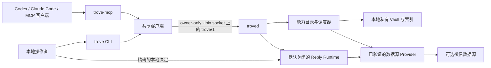

<p align="center">
  <a href="README.md">English</a> · <strong>简体中文</strong>
</p>

<h1 align="center">TROVE</h1>

<p align="center">
  <strong>面向 AI Agent 的本地优先、隐私保护型记忆与引用证据运行时。</strong>
</p>

<p align="center">
  在 macOS 本地为 Codex、Claude Code 和其他 MCP 客户端提供有边界的证据 Vault 访问能力，而不是把个人数据变成云端服务。
</p>

<p align="center">
  <a href="https://github.com/JNHFlow21/trove/actions/workflows/ci.yml"></a>
  <a href="https://github.com/JNHFlow21/trove/actions/workflows/privacy-scan.yml"></a>
  <a href="https://www.apple.com/macos/"></a>
  <a href="https://www.python.org/"></a>
  <a href="LICENSE"></a>
</p>

<p align="center">
  <a href="https://github.com/JNHFlow21/trove/stargazers"></a>
  <a href="https://github.com/JNHFlow21/trove/forks"></a>
  <a href="https://github.com/JNHFlow21/trove/commits/main"></a>
  
</p>

TROVE 不是通用自治 Agent，也不是托管式聊天数据库。外部 Agent 请求回忆、
搜索、上下文或受控操作；TROVE 返回带引用、覆盖范围和大小边界的类型化结果。

产品名称是 **TROVE**。微信只是一个可选数据源 Provider，并不是产品本身。

## 为什么使用 TROVE

| 常见做法 | TROVE |
| --- | --- |
| 把整段对话复制进 Agent 提示词 | 只返回当前任务需要的有边界证据 |
| 让每个客户端直接打开数据库 | 每个规范 Vault 只由一个 owner-only daemon 协调 |
| 把检索文本当成指令 | 消息、文件名、OCR 和转写只能作为不可信证据 |
| 给 Agent 默认写入或发送权限 | 把请求、人类审批与实际发送策略彻底分离 |
| 用自信答案掩盖检索不完整 | 明确返回引用、覆盖范围、游标和类型化错误 |

## 架构



TROVE 不开放公网监听。CLI 和 MCP 适配器使用同一套协议、能力目录、验证与
调度逻辑，因此恢复路径与 Agent 路径不会静默分叉。

## 核心能力

- **有边界的回忆与搜索**：结果上限、响应预算、不透明游标、覆盖元数据和稳定引用。
- **本地优先存储**：Vault、索引、缓存和操作日志都保存在仓库外的 owner-controlled 路径。
- **Agent 原生 MCP**：提供递增的 `standard`、`operations`、`admin` 能力包，应始终使用满足任务的最小能力包。
- **类型化失败语义**：只有 `error.retryable` 为真时才重试；歧义和覆盖不完整会明确返回。
- **Provider 边界**：数据源接入必须实现已验证合约；微信支持单独打包。
- **人类控制的操作**：审批决定必须来自交互式控制终端，MCP 与后台任务无法自行批准。
- **隐私门禁**：合成夹具规则、当前树扫描、Gitleaks 全 Git 历史扫描和 CI 检查。

## 从源码开始

要求：macOS、Python 3.11+、Git。

```bash
git clone https://github.com/JNHFlow21/trove.git
cd trove
TROVE_RUNTIME_INSTALL_EXTRAS="" bash scripts/bootstrap_runtime.sh

export TROVE_VAULT_ROOT="$HOME/Trove/trove-vault"
mkdir -p "$TROVE_VAULT_ROOT"
chmod 700 "$TROVE_VAULT_ROOT"
.venv/bin/trove --vault "$TROVE_VAULT_ROOT" doctor
```

默认的 macOS bootstrap 还支持 `local-vision,local-embedding,zvec`。
其他本地 ASR、VLM、key-capture 或 cloud-retrieval 扩展请先阅读
[测试文档](docs/testing.md)。

### 连接 MCP 客户端

通过 [Agent Switch](https://github.com/JNHFlow21/agent-switch) 注册已安装的
`trove-mcp`：

```text
--pack standard --vault $TROVE_VAULT_ROOT
```

变更中央工具配置前运行 `agent-switch doctor`，变更后运行
`agent-switch reconcile`。不要把密钥复制进原生客户端配置。

## 隐私与安全边界

公开仓库只包含源码、Schema、公开文档和合成测试。真实聊天、联系人、账号
标识、媒体、转写、OCR、Provider payload、本地 Vault、日志、密钥、机器路径和
真实运行证据都不得进入当前目录、生成产物或 Git 历史。

```bash
./scripts/trove-python scripts/privacy_scan.py .
./scripts/trove-python scripts/check.py contract
gitleaks git --redact
```

扫描器只是门禁，不替代人工检查。详见[开源隐私边界](PRIVACY.md)和
[安全策略](SECURITY.md)。Reply Runtime 默认关闭；Agent 可以请求或查看审批，
但只有控制终端上的人类才能决定精确操作。

## 仓库结构

| 路径 | 职责 |
| --- | --- |
| `packages/trove_protocol` | 版本化 `trove/1` Schema 与 wire contract |
| `packages/trove_core` | 能力目录、应用服务、搜索、Vault 与安全边界 |
| `packages/trove_daemon` | 每个规范 Vault 对应的本地 daemon |
| `packages/trove_client` | 所有适配器共用的客户端 |
| `packages/trove_mcp` | 面向外部 Agent 的主要 stdio MCP 接口 |
| `packages/trove_cli` | 操作、恢复、诊断与显式审批接口 |
| `packages/trove_provider_wechat` | 独立打包的可选微信 Provider |
| `skills` | 面向结果的 Agent Skills 与清单 |
| `scripts` | 构建、测试、隐私、发行、性能和迁移门禁 |

## 项目数据

| 公开指标 | 实时数据或最近一次维护者可见数据 |
| --- | ---: |
| Star / Fork / Commit | 见上方实时徽章 |
| README 访问量 | 见上方公开计数器；可能包含机器人和重复访问 |
| 仓库独立访客 | GitHub Traffic 最近 14 天滚动窗口内为 **0** |
| 独立克隆者 | 最近 14 天滚动窗口内为 **15**（共 **21** 次克隆） |

<sub>数据快照日期：2026-08-10。GitHub 只向仓库维护者提供克隆与独立访客数据，因此这里采用注明日期的透明快照，而不是需要私密 Token 的公开徽章。</sub>

### 仓库增长曲线

<p align="center">
  <a href="https://github.com/JNHFlow21/trove/stargazers">
    
  </a>
</p>

<sub>每次获得新 Star 后自动刷新，并每周定时更新。GitHub Traffic 使用仓库所有者可见的 14 天滚动窗口；README 中不嵌入任何长期 Token。</sub>

## 文档

- [架构](docs/architecture.md)
- [MCP 能力包与信任边界](docs/mcp.md)
- [能力参考](docs/capability-map.md)
- [协议](docs/protocol.md)
- [Provider SDK](docs/provider-sdk.md)
- [微信 Provider](docs/providers/wechat.md)
- [运维与恢复](docs/operations.md)
- [测试](docs/testing.md)
- [发行模型](docs/release.md)
- [路线图](docs/roadmap.md)

## 参与贡献

提交 PR 前请阅读 [CONTRIBUTING.md](CONTRIBUTING.md)。削弱隐私、应用边界或
审批边界的变更不会被接受。安全漏洞请通过 GitHub 私密漏洞报告提交，不要创建
公开 Issue。

## 许可证

[Apache License 2.0](LICENSE) © 2026 TROVE contributors
