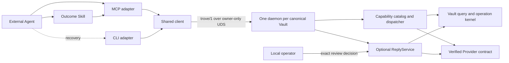

# TROVE architecture

TROVE is a local capability runtime, not an autonomous general-purpose Agent.
Its optional Reply Runtime is one bounded application service owned by the
daemon; it does not expand an external Agent's ambient authority.

The declarative catalog owns capability identifiers, CLI routes, MCP names,
schemas, packs, risk, replay policy, Provider requirements, trust class, and
response budgets. Adapters decode and encode; both call the same daemon handler.
The generated [capability reference](capability-map.md) is therefore descriptive,
not another registry.

Each canonical Vault identity has exactly one daemon. The daemon owns storage
connections, indexes, caches, cursor state, operation journals, writer
coordination, and the verified Provider registry. A client handshake binds the
protocol, runtime build, catalog hash, Vault identity, peer user, deadline, and
frame budget. There is no public network listener.

Short reads return one envelope. Long or mutating work returns a durable
operation with an explicit replay policy and typed continuation owner. Opaque
cursors bind filters, high-water mark, generation, and expiry; stale cursors
fail rather than claim complete coverage.

Provider and Vault strings, media metadata, OCR, and transcripts are untrusted
evidence. Only core control code can create capability identifiers, `next`,
approval state, or action arguments. The detailed dependency rule is in the
[application boundary](architecture/application-boundary.md); wire semantics
are in the [protocol guide](protocol.md). Reply collection, generation, review,
delivery, and reconciliation are specified in
[Reply Runtime](architecture/reply-runtime.md).
