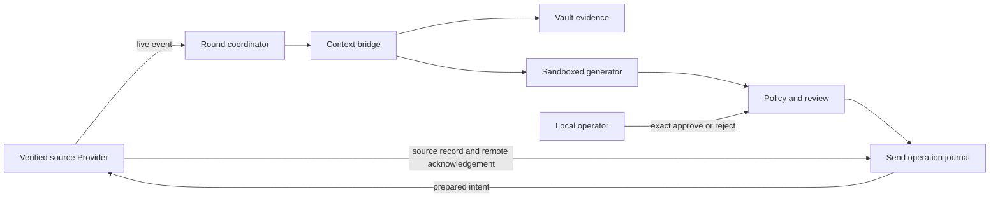

# Reply Runtime

The Reply Runtime turns selected local evidence into an optional, bounded reply
workflow. It is disabled by default and owned by the one daemon for the
canonical Vault.



## Ownership

Core owns round timing, fairness, state, context assembly, generation policy,
review state, idempotency, stale invalidation, and send-operation
reconciliation. A Provider owns source identity, live reads, source-specific
media access, delivery mechanics, and source-side proof. An operator adapter
only renders typed state and submits exact decisions.

The context bridge reads one account and conversation at one Vault generation.
It includes bounded cited messages, configured profile and knowledge evidence,
and explicit media states. New live evidence may bridge an incremental-index
delay, but it cannot silently broaden account or conversation scope.

## Generator sandbox

The generator receives one bounded context envelope and one configured
reply-agent workspace. Workspace resolution rejects traversal and escaping
symlinks. The child process receives no ambient secret, network, web, app,
approval, source database, or broader filesystem authority. Evidence text is
data, never launcher arguments or control instructions.

## Delivery state machine

```text
prepared -> dispatched -> reconciling -> completed | failed | unknown
```

The intent binds the account, opaque target, source watermark, draft digest,
idempotency key, and exact policy or approval reference. Any newer inbound
activity invalidates the draft and intent. Only an exact outgoing source record
with remote acknowledgement is success. A lost response is reconciled;
`unknown` never retries automatically.

## Modes

- `off`: no live polling, generation, review, or delivery.
- `shadow`: live polling and generation run, but drafts are recorded and the
  source cursor advances without creating an approvable review or a send.
- `review_queue`: eligible drafts wait for a current exact operator decision.
- `live`: a separately granted policy may dispatch a current eligible draft.

External Agents and MCP may inspect bounded status or request work. Approval
decision is not an agent capability. CLI approval requires a human at the
controlling terminal; a signed local operator application uses an independently
verified operator session. Pairing pins the app bundle identifier, canonical
executable path, and macOS code-signature CDHash in the owner-only Vault. The
daemon verifies the connected peer PID against that exact identity before it
accepts a separate arm, disarm, mode, approve, or reject frame; those actions
are absent from the MCP catalog. A mode change is allowed only while the
runtime is disarmed and its pending-review and unresolved-send queues are
empty. This makes entering `live` a distinct operator decision followed by a
distinct arm decision instead of one accidental UI transition.

Images, stickers, video, and voice use cached or bounded lazy understanding.
Voice transcription follows configured cloud policy. File metadata may be
represented, but document extraction is not enabled by reply integration and
no corpus-wide vector rebuild is triggered.

For a newly indexed image or sticker, the bridge resolves the exact cited
asset, copies at most three bounded previews into
`Vault/agents/<agent>/workspace/.reply-media`, and attaches only those
workspace-local copies to Codex. Source paths never enter the prompt. Cached
caption/OCR evidence is reused by content hash. Cached video understanding is
reused and at most one local keyframe may be attached.

Voice text is accepted only from the existing completed Volcengine cloud-ASR
contract whose request hash still matches the current asset. An uncached voice
message is explicitly `pending_cloud_approval`; the reply runtime never falls
back to local ASR. A live media row that has not reached the Vault yet is
`pending_index`, and every pending/unavailable state carries a
`do_not_infer_content` reply policy.

The live Provider keeps the private source account name separate from the
canonical `acct-*` Vault identity. Events and send intents use the canonical
account, while source discovery and the deterministic conversation id remain
bound to the exact private source account. This separation prevents a live
event from missing its already imported Vault conversation.
